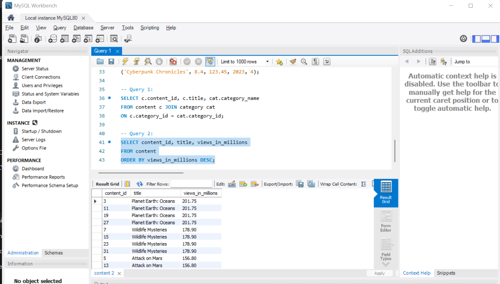
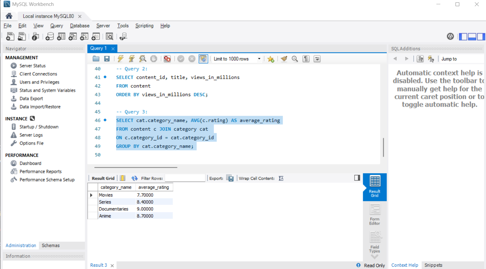
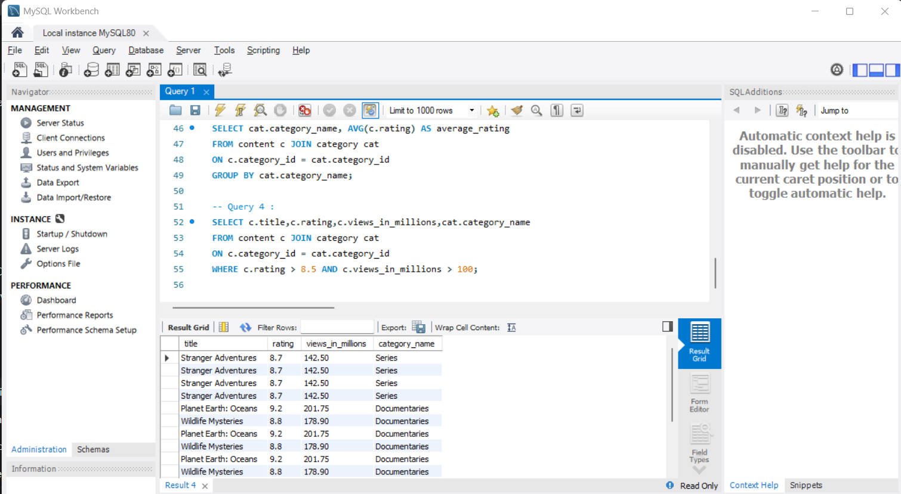

## Query 1:  
SELECT c.content_id, c.title, cat.category_name
FROM content c JOIN category cat
ON c.category_id = cat.category_id;

## Query 2:
SELECT content_id, title, views_in_millions
FROM content
ORDER BY views_in_millions DESC;

-- Query 3:
SELECT cat.category_name, AVG(c.rating) AS average_rating
FROM content c JOIN category cat 
ON c.category_id = cat.category_id
GROUP BY cat.category_name;

-- Query 4 :
SELECT c.title,c.rating,c.views_in_millions,cat.category_name
FROM content c JOIN category cat 
ON c.category_id = cat.category_id
WHERE c.rating > 8.5 AND c.views_in_millions > 100;

-- Query 5: 
-- Step 1 :

EXPLAIN ANALYZE
SELECT c.content_id,c.title, cat.category_name
FROM content c JOIN category cat
ON c.category_id = cat.category_id;

-- Step 2 :
CREATE INDEX idx_category_id ON content(category_id);

-- Step 3 : 

EXPLAIN ANALYZE
SELECT c.content_id,c.title, cat.category_name
FROM content c JOIN category cat
ON c.category_id = cat.category_id;

