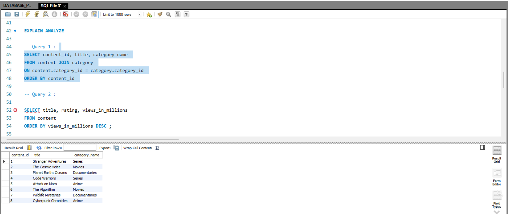
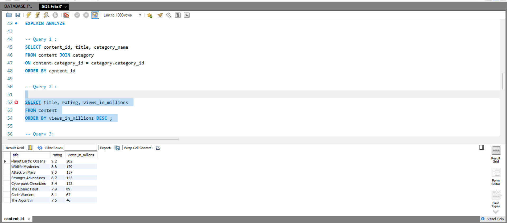
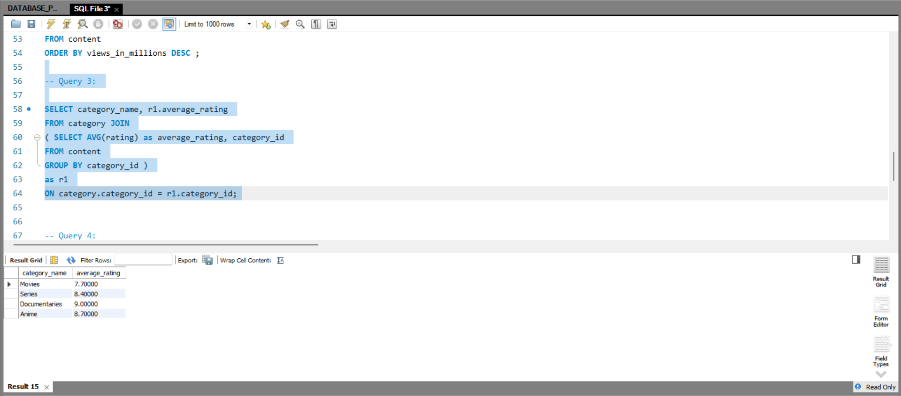
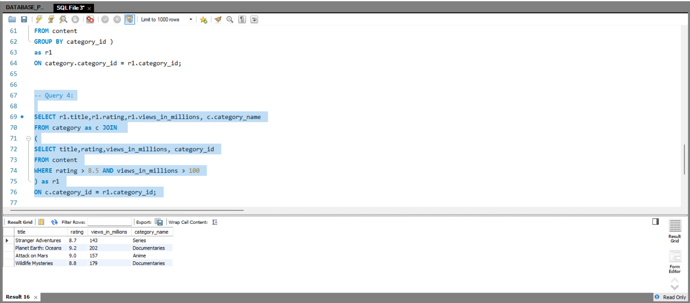
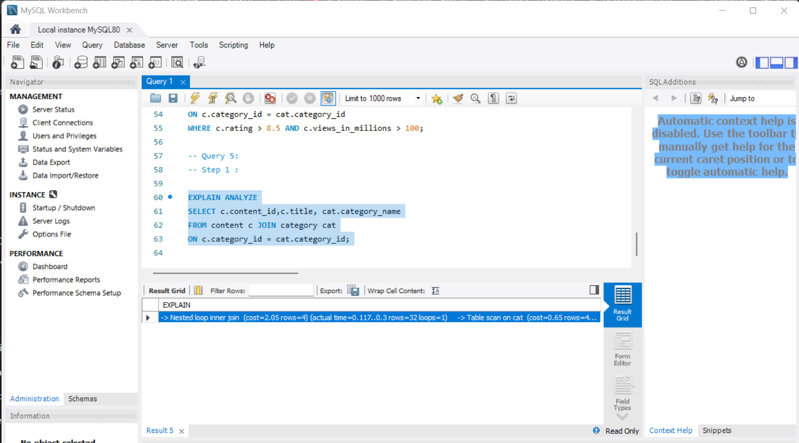
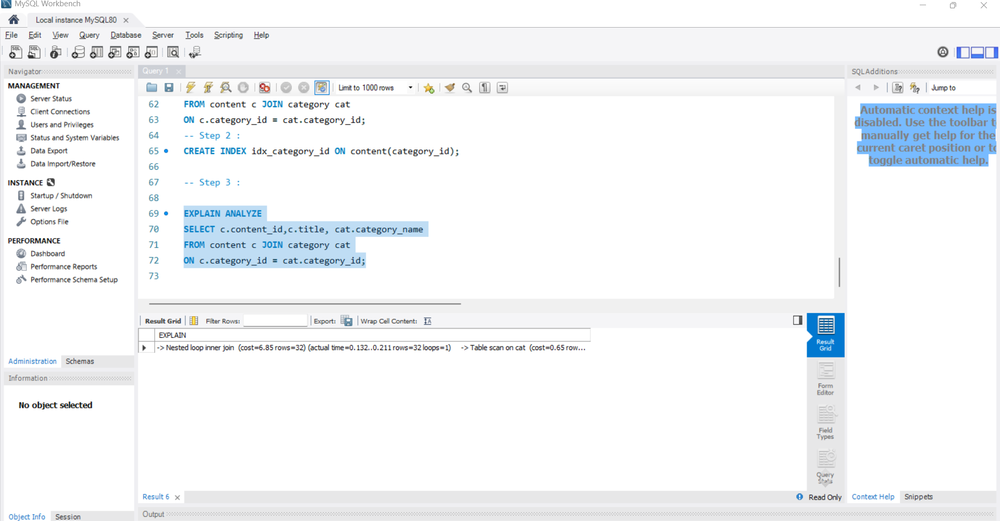

## Query 1:  

SELECT content_id, title, category_name 
FROM content JOIN category 
ON content.category_id = category.category_id 
ORDER BY content_id 

## Query 2:
SELECT content_id, title, views_in_millions
FROM content
ORDER BY views_in_millions DESC;

-- Query 3:
SELECT cat.category_name, AVG(c.rating) AS average_rating
FROM content c JOIN category cat 
ON c.category_id = cat.category_id
GROUP BY cat.category_name;

-- Query 4 :
SELECT c.title,c.rating,c.views_in_millions,cat.category_name
FROM content c JOIN category cat 
ON c.category_id = cat.category_id
WHERE c.rating > 8.5 AND c.views_in_millions > 100;

-- Query 5: 
-- Step 1 :

EXPLAIN ANALYZE
SELECT c.content_id,c.title, cat.category_name
FROM content c JOIN category cat
ON c.category_id = cat.category_id;

-- Step 2 :
CREATE INDEX idx_category_id ON content(category_id);

-- Step 3 : 

EXPLAIN ANALYZE
SELECT c.content_id,c.title, cat.category_name
FROM content c JOIN category cat
ON c.category_id = cat.category_id;

Why 1: Why do we use Foreign Keys?

Foreign keys help keep data clean and meaningful. If someone tries to add a movie with a category_id = 999 that doesn’t exist, the database will block it. Without a foreign key, the database may allow random or incorrect category values, leading to broken links and confusing data.

Why 2: Why is ACID important for this database?

ACID ensures that the database remains accurate and reliable, even when many users are using it at the same time. For example, if 1000 people watch "Stranger Adventures" and the system updates the views count, ACID makes sure the final count is correct and no update gets lost or overwritten. Without ACID, data could become inconsistent, corrupted, or even partially saved.

Why 3: Why would we create an index on category_id?

An index on category_id helps the database find relevant content much faster, similar to how a book index helps you quickly locate a topic instead of reading every page. When the StreamFlix homepage loads and runs hundreds of category-based queries, the index avoids scanning the whole table and speeds up the response time significantly. This improves performance and makes the app feel faster for users.